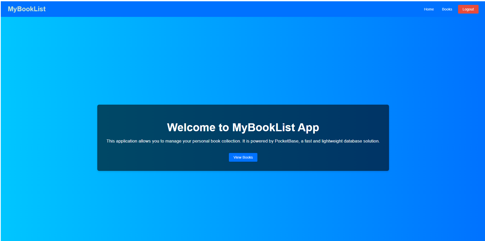

# MyBookList App

MyBookList App is a web application for managing your personal book collection. The application is built using Vue.js 3 and TypeScript, with PocketBase as the backend database solution. This application allows users to register, log in, view, add, edit, and delete books. It also includes authentication and authorization features to ensure that only logged-in users can manage the book collection.

## Table of Contents
- [Technologies Used](#technologies-used)
- [Features](#features)
- [Project Structure](#project-structure)
- [Setup and Installation](#setup-and-installation)
- [Usage](#usage)
- [Screenshots](#screenshots)
- [Future Improvements](#future-improvements)
- [Contributing](#contributing)
- [License](#license)

## Technologies Used

- **Vue.js 3**: A progressive JavaScript framework for building user interfaces.
- **TypeScript**: A typed superset of JavaScript that compiles to plain JavaScript.
- **PocketBase**: An open-source backend alternative with a built-in database, authentication, and file storage.
- **Pinia**: A state management library for Vue.js applications.
- **Axios**: A promise-based HTTP client for making requests to the backend.
- **Vue Router**: The official router for Vue.js, used for navigating between different pages in the application.
- **ESLint**: A static code analysis tool for identifying problematic patterns found in JavaScript code.
- **Prettier**: An opinionated code formatter to ensure consistent code style.
- **CSS**: Used for styling the application and making it look modern and responsive.

## Features

- **User Authentication**: Users can register and log in to the application.
- **Authorization**: Only authenticated users can access the main features of the app, such as viewing and managing books.
- **CRUD Operations**: Users can create, read, update, and delete books from their collection.
- **Responsive Design**: The application is designed to work well on both desktop and mobile devices.
- **Modals for Edit and Delete Confirmation**: User-friendly modals are used for editing book details and confirming deletion of books.

## Project Structure

The project is structured as follows:

\`\`\`
my-vue-pocketbase-app/
├── public/
│   └── index.html
├── src/
│   ├── assets/
│   ├── components/
│   ├── router/
│   │   └── index.ts
│   ├── services/
│   │   └── api.ts
│   ├── stores/
│   │   └── auth.ts
│   ├── views/
│   │   ├── Books.vue
│   │   ├── HomePage.vue
│   │   ├── Login.vue
│   │   ├── Register.vue
│   └── App.vue
│   └── main.ts
├── .eslintrc.js
├── .prettierrc
├── package.json
├── tsconfig.json
├── vite.config.ts
└── README.md
\`\`\`

## Setup and Installation

To set up and run this project locally, follow these steps:

### 1. Clone the Repository

Clone the repository and navigate into the project directory:
\`\`\`bash
git clone https://github.com/umithavare/my-vue-pocketbase-app.git
cd my-vue-pocketbase-app
\`\`\`

### 2. Install Dependencies

Install the required dependencies:
\`\`\`bash
npm install
\`\`\`

### 3. Setup PocketBase

Download and extract PocketBase from the [PocketBase website](https://pocketbase.io/). You can place the extracted files in a directory of your choice. 

Start the PocketBase server:
\`\`\`bash
./pocketbase serve
\`\`\`

This will start the PocketBase server on \`http://localhost:8090\`.

### 4. Run the Development Server

Start the Vue development server:
\`\`\`bash
npm run dev
\`\`\`

The application will be available at \`http://localhost:3000\`.

## Usage

### Register

- Go to the Register page by clicking the "Register" link on the Login page.
- Enter your email and password to create a new account.

### Login

- Enter your email and password to log in.
- After logging in, you will be redirected to the Home page.

### View Books

- Click on the "Books" link in the navigation bar to view your book collection.

### Add Book

- Enter the title and author of the book in the provided form.
- Click the "Add Book" button to add the book to your collection.

### Edit Book

- Click the "Edit" button next to a book to open the edit modal.
- Update the book details and click "Update Book" to save the changes.

### Delete Book

- Click the "Delete" button next to a book to open the delete confirmation modal.
- Confirm the deletion to remove the book from your collection.

## Screenshots

### Home Page

### Books Page

### Register Page

### Login Page

### Delete Modal

### Update Modal

## Future Improvements

- Add user profile management.
- Implement pagination for the book list.
- Add search functionality to filter books.
- Improve error handling and display error messages to users.
- Enhance the UI/UX with additional animations and design improvements.

## Contributing

Contributions are welcome! Please fork the repository and submit a pull request for any improvements or bug fixes.

## License

This project is licensed under the MIT License. See the [LICENSE](LICENSE) file for details.
